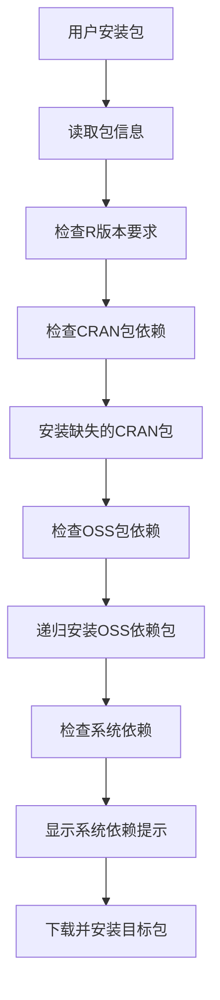
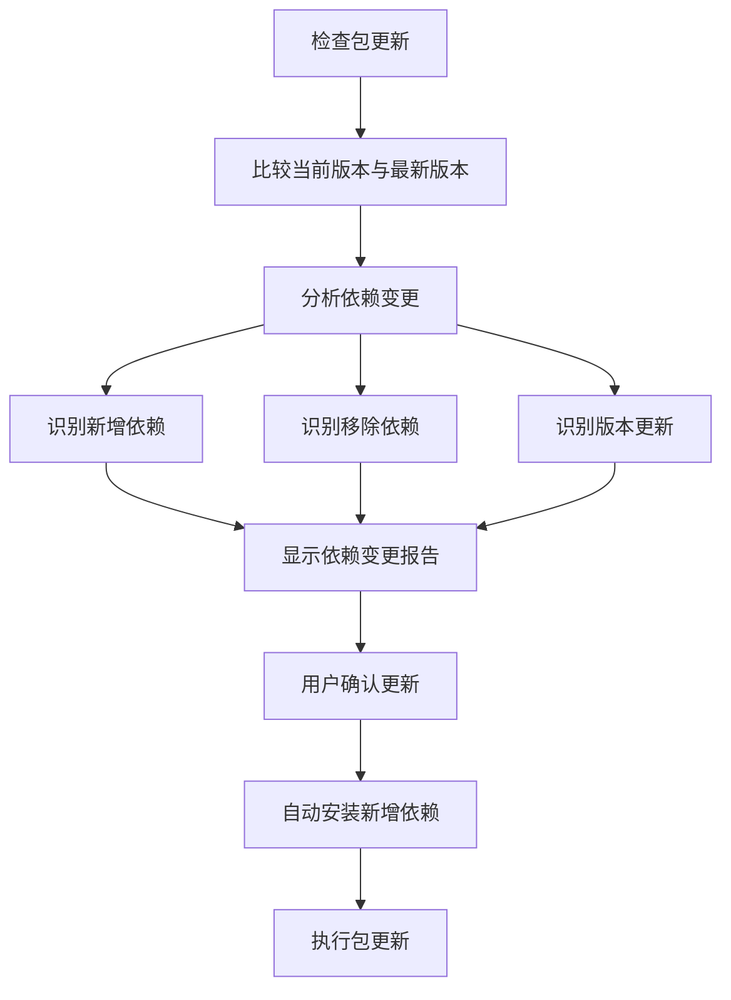

# 阿里云OSS文件夹结构设计

## OSS Bucket 结构

```
your-bucket-name/
├── packages/                    # R包存储目录
│   ├── package1/
│   │   ├── package1_1.0.0.tar.gz
│   │   ├── package1_1.0.1.tar.gz
│   │   └── package1_1.1.0.tar.gz
│   ├── package2/
│   │   ├── package2_0.1.0.tar.gz
│   │   └── package2_0.2.0.tar.gz
│   └── .../
├── metadata/                    # 元数据目录
│   └── packages.json           # 统一配置文件（包含所有信息）
└── docs/                       # 文档目录
    ├── README.md
    └── package_docs/
        ├── package1.md
        └── package2.md
```

## 配置文件格式

### packages.json（统一配置文件 - v2.0 支持完整依赖管理）

```json
{
  "last_updated": "2025-07-25T07:22:51Z",
  "repository_info": {
    "name": "zstats私有包仓库", 
    "description": "zstats团队私有R包仓库",
    "version": "1.0.0"
  },
  "packages": [
    {
      "name": "ZGBD",
      "current_version": "0.0.1",
      "description": "zstats数据处理包",
      "description_cn": "zstats数据处理包，提供基础GBD等数据分析功能",
      "author": "zstats团队",
      "maintainer": "zstats@example.com",
      "dependencies": {
        "r_version": "R (>= 4.0.0)",
        "oss_packages": [
          {
            "name": "zstatsBase",
            "version": ">= 1.0.0",
            "required": true,
            "description": "zstats基础功能包"
          }
        ],
        "cran_packages": [
          {
            "name": "jsonlite",
            "version": ">= 1.7.0",
            "required": true,
            "description": "JSON数据处理"
          },
          {
            "name": "dplyr",
            "version": ">= 1.0.0",
            "required": true,
            "description": "数据操作"
          },
          {
            "name": "ggplot2",
            "version": ">= 3.3.0",
            "required": false,
            "description": "数据可视化（可选）"
          }
        ],
        "system_dependencies": [
          {
            "name": "libcurl",
            "platform": "linux",
            "required": true,
            "description": "HTTP客户端库",
            "install_command": "apt-get install libcurl4-openssl-dev"
          },
          {
            "name": "openssl",
            "platform": "all",
            "required": true,
            "description": "加密库"
          }
        ]
      },
      "versions": [
        {
          "version": "0.0.1",
          "release_date": "2025-07-25",
          "file": "packages/ZGBD/ZGBD_0.0.1.zip",
          "sha256": "80880d96d30746665e3268c9ce0964416a1b336a1df6258e09e6c85e786da623",
          "md5": "c9766ed658a72e57ffb89db13cd31bbf",
          "size": 61820075,
          "changes": "初始版本发布",
          "breaking_changes": false,
          "dependency_changes": {
            "added": [
              {
                "type": "cran",
                "name": "dplyr",
                "version": ">= 1.0.0"
              }
            ],
            "removed": [],
            "updated": []
          }
        }
      ],
      "tags": ["finance", "data-analysis", "bonds"],
      "license": "MIT",
      "homepage": "https://github.com/zstats/ZGBD",
      "repository": "https://github.com/zstats/ZGBD.git",
      "install_priority": 1
    }
  ]
}
```

### 新增依赖管理字段说明

#### dependencies 对象
- `r_version`: R版本要求，支持版本表达式
- `oss_packages`: OSS私有包依赖列表
- `cran_packages`: CRAN包依赖列表  
- `system_dependencies`: 系统级依赖列表

#### 依赖包对象结构
```json
{
  "name": "包名",
  "version": "版本要求表达式（>=, <=, ==, >, <）",
  "required": true/false,
  "description": "依赖包描述"
}
```

#### 系统依赖对象结构
```json
{
  "name": "依赖名称",
  "platform": "目标平台（linux/windows/macos/all）",
  "required": true/false,
  "description": "依赖描述",
  "install_command": "安装命令（可选）"
}
```

#### dependency_changes 对象
记录每个版本的依赖变更：
```json
{
  "added": [{"type": "cran/oss", "name": "包名", "version": "版本"}],
  "removed": [{"type": "cran/oss", "name": "包名", "version": "版本"}],
  "updated": [{"type": "cran/oss", "name": "包名", "old_version": "旧版本", "new_version": "新版本"}]
}
```

## OSS访问配置

### 固定配置
- OSS URL: `https://zstats-packages.oss-cn-hangzhou.aliyuncs.com/`
- Bucket权限：公共读
- 无需用户配置，包内预设固定地址

### 访问示例
```r
# 所有配置都是预设的，用户无需配置
# 获取包列表配置
packages_url <- "https://zstats-packages.oss-cn-hangzhou.aliyuncs.com/metadata/packages.json"

# 下载特定包
package_url <- "https://zstats-packages.oss-cn-hangzhou.aliyuncs.com/packages/package1/package1_1.1.0.tar.gz"
```

## 校验和生成

使用新增的工具函数自动生成：

```r
# 为包文件生成校验和
generateChecksums("path/to/package.tar.gz")

# 批量为目录下所有包生成校验和
generatePackageMetadata("packages/")
```

## 更新流程

1. 开发者将新版本R包上传到对应目录（支持.tar.gz和.zip格式）
2. 使用工具函数生成校验和和依赖信息：
   ```r
   # 自动生成包含依赖信息的元数据
   generatePackageMetadata("packages/")
   
   # 或者手动指定依赖信息
   package_info <- list(
     dependencies = list(
       cran_packages = list(
         list(name = "dplyr", version = ">= 1.0.0", required = TRUE)
       ),
       oss_packages = list(
         list(name = "zstatsBase", version = ">= 1.0.0", required = TRUE)
       )
     )
   )
   updatePackageMetadata("mypackage", "packages/mypackage/mypackage_1.0.0.zip", 
                        package_info = package_info)
   ```
3. 系统自动生成依赖变更信息和更新 metadata/packages.json
4. 客户端自动获取更新信息和依赖变更（无需配置）

## 优势

1. **简化配置**：只有一个配置文件，信息集中管理
2. **无需配置**：用户安装即用，不需要设置OSS地址
3. **智能依赖管理**：自动检测、安装和管理所有类型依赖
4. **依赖变更追踪**：精确记录每个版本的依赖变更历史
5. **多格式支持**：同时支持tar.gz源码包和zip二进制包
6. **自动生成**：校验和、元数据和依赖信息自动生成，减少人工错误
7. **版本集中**：包的所有版本信息都在同一个文件中，便于管理
8. **递归依赖处理**：自动处理依赖包的依赖，避免循环依赖
9. **版本要求验证**：支持复杂的版本要求表达式和冲突检测
10. **向后兼容**：完全兼容旧版本格式，自动迁移

## 依赖管理工作流程

### 安装时的依赖处理



### 更新时的依赖变更检测



### 支持的版本要求表达式

- `>= 1.0.0`: 大于等于版本1.0.0
- `<= 1.5.0`: 小于等于版本1.5.0  
- `== 1.2.0`: 严格等于版本1.2.0
- `> 1.0.0`: 大于版本1.0.0
- `< 2.0.0`: 小于版本2.0.0 